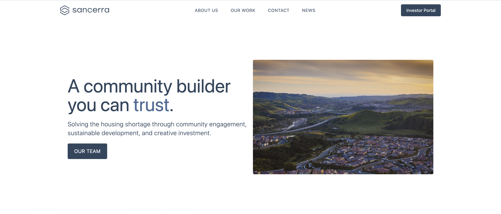
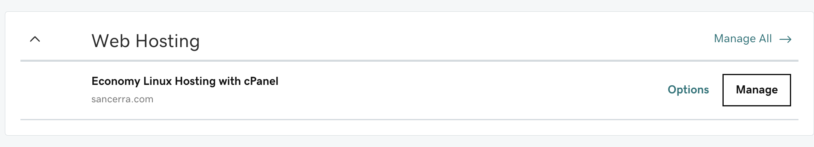
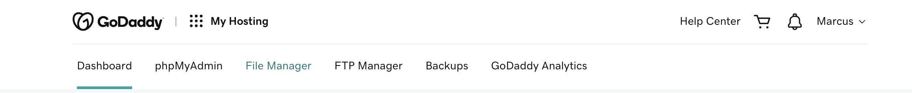
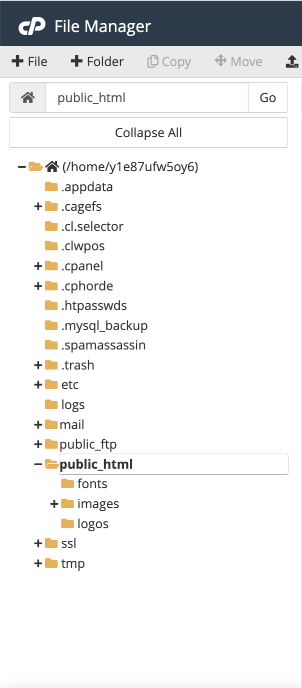
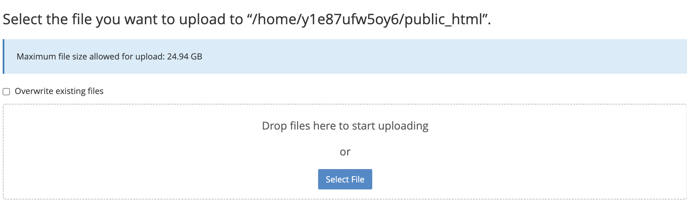
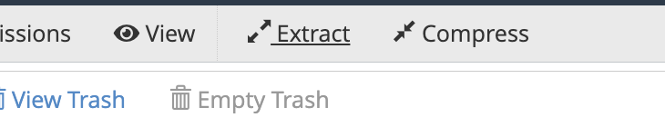

# Sancerra Website Guide


**Table of Contents**

 1. What is used
 2. Getting started
 3. Development
 4. Deployment

# What is used?

**Tech stack**
 - HTML
 - Tailwind CSS (https://tailwindcss.com/docs/installation)
 - Alpine JS (https://alpinejs.dev/start-here)

**Development**
 - Webpack (https://webpack.js.org/concepts/)
  
# Getting started

1. Download the project files or clone the repository from GitHub
2. Run `npm i` in the root folder

There are 2 main scripts that you can run in this project
 1. `npm run build` – this is for building the project 
 2. `npm run dev` – this is for running the project locally

# Development

Each HTML file represents a different page in the website.

> index.html --> home page
> about.html --> about page
> work.html --> work page
> etc.

Each file is self documented with comments and direction on how to edit them.

The styling of each file is included in the HTML file. You can read more into TailwindCSS (https://tailwindcss.com/docs/utility-first) to see how it works.

There are 2 places where global CSS is used. You can consider these 
 1. The first is styles.css in the src/ folder.
	- This handles our theme fonts
 3. The second is the tailwind.config.js
	 - This handles our theme colors, font sizes, and screen breakpoints for mobile.
	> You can add/remove anything from these files, but they will affect the whole website.

**To run this website locally, you can either:**
1. Open index.html with a browser
2. Run ```npm run dev``` in the root folder for hot reloading, then run a local server for the website
	> Note: this will not work if **npm** is not installed
  

# Deployment

The website is hosted on GoDaddy.
There are 2 steps needed to deploy this website: locally and remotely (on GoDaddy)

**Locally**
 1. Run ```npm run build``` in the root folder
 2. Compress the contents of the src/ folder into a .zip file
	> All the project files are in the **src/** folder. Don't compress anything outside of that

**On GoDaddy**
 1. Go to https://account.godaddy.com/products?go_redirect=disabled
 2. Navigate to ***Web Hosting***
	 - Click **Manage** on Economy Linux Hosting with cPanel
    
 3. Navigate to ***File Manager***
    
 4. On the left, click ***public_html***
    
 5. Upload the .zip file
    
 6. Extract the .zip file in public_html. This will automatically override old files.
	> DON'T touch the .htaccess file. It ensures that all traffic to the website is secure and it removes the *".html"* from the url
    
7. Test the website and make sure all the links work
